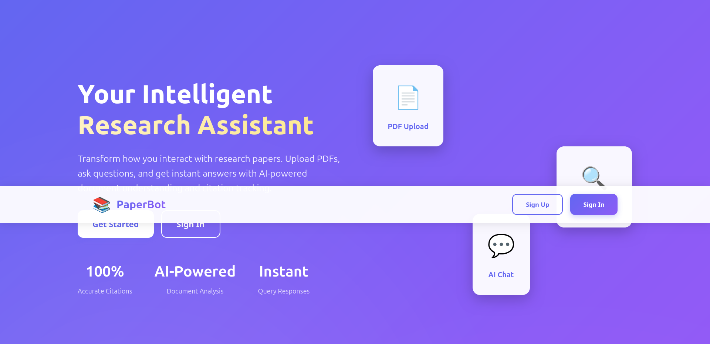
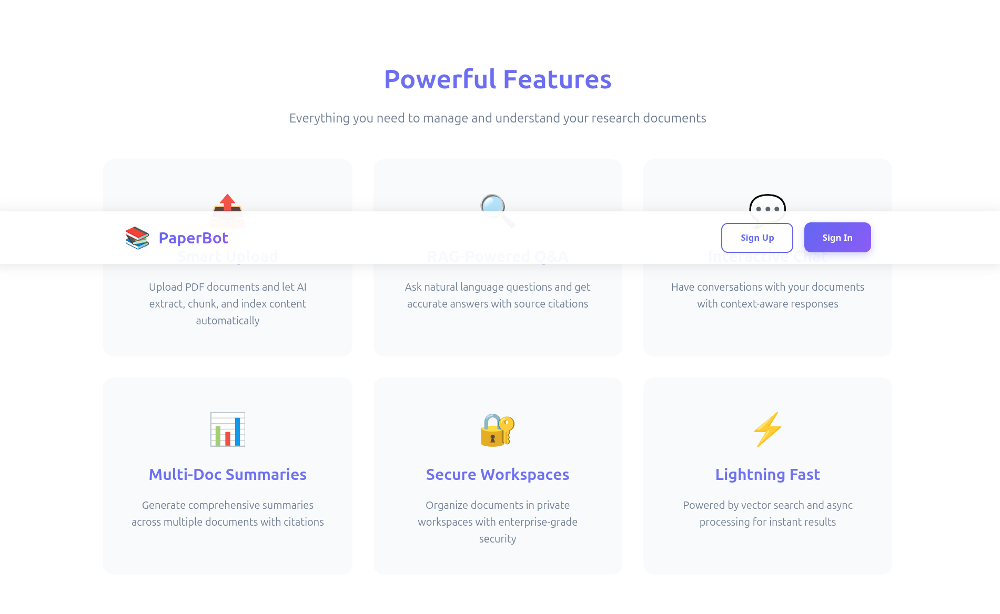

# PaperBot - Research Assistant Agent

A backend-first system (Django + DRF) that ingests PDFs, extracts text, chunks & embeds content, stores embeddings in a vector DB, supports RAG-based Q/A and multi-document summarization with citation provenance.

## 📸 Screenshots

### Dashboard & Main Interface

*Main dashboard showing workspaces, document management, and navigation tabs*

### Features Overview

*Query interface, chat functionality, and document summarization features*

## Features

- **PDF Ingestion Pipeline**: Upload → OCR/text extraction → clean → chunk → embed → index (async via Celery)
- **RAG Q/A Endpoint**: Natural-language query + workspace id → retrieve top-k chunks → call LLM → return answer + cited chunk references
- **Multi-Document Summarization**: Produce short summary and related-work paragraph with inline citation provenance
- **Iterative Chat**: Maintain per-session context and retrieval history; support follow-ups
- **Admin/Versioning**: Manage and version embedding & generation model artifacts
- **Security & Ops**: JWT auth, per-user workspaces, rate limiting, audit logs

## Tech Stack

- **Backend**: Django 4.2, Django REST Framework
- **Task Queue**: Celery + Redis
- **Database**: PostgreSQL
- **Vector DB**: FAISS (can be switched to Milvus/Weaviate)
- **PDF Processing**: PDFMiner
- **Embeddings**: sentence-transformers
- **LLM**: OpenAI/Anthropic (configurable)
- **Frontend**: React + Vite

## Quick Start

### Prerequisites

- Docker and Docker Compose
- Python 3.11+
- Node.js 18+ (for frontend)

### Local Development

1. **Clone and setup**:
```bash
cd PaperBot
cp .env.example .env
# Edit .env with your configuration
```

2. **Start with Docker**:
```bash
docker-compose up -d
```

3. **Or run locally**:
```bash
# Backend
python -m venv venv
source venv/bin/activate  # On Windows: venv\Scripts\activate
pip install -r requirements.txt
python manage.py migrate
python manage.py createsuperuser
python manage.py runserver

# Celery worker (in separate terminal)
celery -A paperbot worker -l info

# Frontend (in separate terminal)
cd frontend
npm install
npm run dev
```

4. **Access**:
   - Backend API: http://localhost:8000
   - Frontend: http://localhost:3000
   - Admin: http://localhost:8000/admin

## API Endpoints

### Authentication
- `POST /api/auth/token/` - Obtain JWT token
- `POST /api/auth/token/refresh/` - Refresh token
- `POST /api/auth/users/register/` - Register user

### Documents
- `POST /api/documents/upload/` - Upload PDF
- `GET /api/documents/` - List documents

### RAG
- `POST /api/query/` - RAG-based Q/A
- `POST /api/summarize/` - Multi-document summarization

### Chat
- `POST /api/chat/` - Create chat session
- `POST /api/chat/{id}/message/` - Send message

See `openapi.yaml` for full API documentation.

## Usage Examples

### Upload a Document
```bash
curl -X POST http://localhost:8000/api/documents/upload/ \
  -H "Authorization: Bearer YOUR_TOKEN" \
  -F "workspace_id=1" \
  -F "file=@document.pdf" \
  -F "title=Research Paper"
```

### Query Documents
```bash
curl -X POST http://localhost:8000/api/query/ \
  -H "Authorization: Bearer YOUR_TOKEN" \
  -H "Content-Type: application/json" \
  -d '{
    "workspace_id": 1,
    "query": "What is the main contribution of this paper?",
    "top_k": 5
  }'
```

### Summarize Documents
```bash
curl -X POST http://localhost:8000/api/summarize/ \
  -H "Authorization: Bearer YOUR_TOKEN" \
  -H "Content-Type: application/json" \
  -d '{
    "workspace_id": 1,
    "document_ids": [1, 2, 3],
    "summary_type": "related_work"
  }'
```

## Project Structure

```
PaperBot/
├── paperbot/          # Django project settings
├── core/              # Core models (User, Workspace, Document, etc.)
├── api/               # API views, serializers, tasks
├── frontend/          # React frontend
├── notebooks/         # Jupyter notebooks for demos
├── docker-compose.yml # Docker setup
├── requirements.txt   # Python dependencies
└── README.md
```

## Milestones

1. ✅ PDF upload + async text extraction → stored chunks
2. ✅ Embeddings + vector indexing
3. ✅ Basic RAG Q/A API returning citations
4. ✅ Multi-doc summarization with provenance
5. ✅ Session/iterative chat
6. ✅ Model/artifact versioning, rate limits, deployment config

## Configuration

Key environment variables (see `.env.example`):
- `SECRET_KEY`: Django secret key
- `DB_*`: PostgreSQL configuration
- `REDIS_URL`: Redis connection
- `OPENAI_API_KEY` / `ANTHROPIC_API_KEY`: LLM API keys
- `EMBEDDING_MODEL`: Sentence transformer model name
- `VECTOR_DB_TYPE`: Vector DB type (faiss, milvus, weaviate)

## Testing

```bash
python manage.py test
```

## Development

### Running Celery Tasks
```bash
celery -A paperbot worker -l info
celery -A paperbot beat -l info  # For periodic tasks
```

### Accessing Django Admin
1. Create superuser: `python manage.py createsuperuser`
2. Visit: http://localhost:8000/admin

### Jupyter Notebook
See `notebooks/rag_demo.ipynb` for embedding training and RAG flow examples.

## License

MIT


